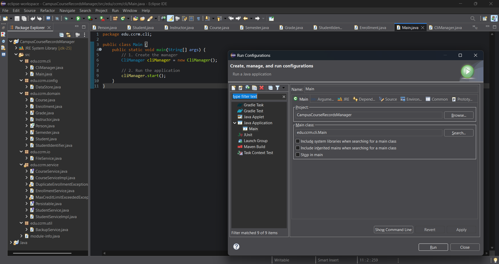

# Campus Course & Records Manager (CCRM)

## Project Overview

The **Campus Course & Records Manager (CCRM)** is a comprehensive, console-based Java application designed to manage academic records for an educational institute. It provides a command-line interface (CLI) for administrators to handle student data, course information, enrollments, and grading. The project is built entirely on Java SE, demonstrating a wide range of core Java concepts, from Object-Oriented Programming (OOP) principles to modern APIs like NIO.2 for file operations and the Date/Time API.

The application supports creating and updating student and course records, enrolling students in courses with validation rules, recording grades, generating transcripts, and performing file-based data management including CSV import/export and timestamped backups.

---

## Features

* **Student Management:** Add, list, update, and deactivate student records. View detailed student profiles and academic transcripts.
* **Course Management:** Create, list, update, and manage courses. Assign instructors and search/filter courses using the Stream API.
* **Enrollment & Grading:** Handle student enrollment and unenrollment with business logic (e.g., maximum credit limits). Record marks, compute letter grades, and calculate GPA.
* **File Operations:** Import and export data (students, courses, enrollments) using simple text files (CSV-like format).
* **Data Backup Utility:** Create timestamped backups of all application data in a dedicated `backups` directory. Includes a recursive utility to calculate the size of backup folders.
* **Menu-Driven CLI:** A user-friendly, interactive console for navigating all the application's features.

---

## How to Run

### Prerequisites

* **Java Development Kit (JDK) 21** or higher.
* **Eclipse IDE** for Java Developers (or any other IDE that supports Maven/Gradle or standard Java projects).
* A command-line terminal (like Command Prompt, PowerShell, or Git Bash on Windows).

### Steps to Run from Eclipse IDE

1.  **Clone the repository:**
    ```bash
    git clone https://github.com/080abhinav/Campus-Course-Records-Manager
    ```
2.  **Import the project into Eclipse:**
    * Open Eclipse IDE.
    * Go to `File` > `Import...`.
    * Select `General` > `Existing Projects into Workspace` and click `Next`.
    * Browse to the directory where you cloned the repository and select the `CampusCourseRecordsManager` folder.
    * Click `Finish`.
3.  **Run the application:**
    * Locate the `Main.java` file in the `edu.ccrm.cli` package.
    * Right-click on `Main.java` and select `Run As` > `Java Application`.
    * The application's CLI menu will appear in the console window.

---

## Project Structure

The project follows a standard layered architecture, organized into packages for clear separation of concerns, as recommended in the project brief.

```text
+-- data/           // Sample data files (e.g., students.csv)
|   +-- students.csv
|   +-- courses.csv
+-- screenshots/
+-- src/            // All Java source code
|   +-- edu
|       +-- ccrm
|           +-- cli/
|           +-- config/
|           +-- domain/
|           +-- io/
|           +-- service/
|           +-- util/
+-- .gitignore      // Specifies intentionally untracked files to ignore
+-- README.md       
```


## Usage / Demo Flow

The application starts with a main menu. Below is a sample interaction flow:

1.  **Start the application.** The `DataStore` Singleton is initialized, loading any existing data.
2.  **The main menu is displayed:**
    ```
    =================================================
    Welcome to Campus Course & Records Manager (CCRM)
    =================================================
    1. Manage Students
    2. Manage Courses
    3. Manage Enrollments & Grades
    4. Data Utilities (Import/Export/Backup)
    5. View Reports
    0. Exit
    Enter your choice:
    ```
3.  **Add a new student:** Choose `1`, then the option to "Add Student". Enter details like name, email, etc.
4.  **Enroll the student in a course:** Choose `3`, then "Enroll Student". Select a student and a course. The system will validate against the maximum credit limit.
5.  **Record grades:** Choose `3`, then "Record Grades". Enter marks for the student in the enrolled course.
6.  **Print a transcript:** Choose `1`, then "View Student Profile/Transcript". Select the student to see their complete academic record, demonstrating `toString()` overrides and polymorphism.
7.  **Export and Backup Data:** Choose `4`, then "Export All Data". Then, choose "Backup Data". A new timestamped folder will be created in the `backups` directory.
8.  **View Backup Size:** Choose `4`, then "Calculate Backup Size". This uses a recursive method to calculate and display the total size of the `backups` directory.
9.  **Exit:** Choose `0` to gracefully shut down the application.

---

## Core Java Concepts Demonstrated (Mapping)

This table maps the mandatory technical requirements from the project specification to their implementation within the source code.

| Concept/Syllabus Topic | Demonstrated In (File/Class/Method) | Notes |
| :----------------------- | :---------------------------------- | :---- |
| **Language & Core** | | |
| Packages | `edu.ccrm.*` (e.g., `domain`, `service`, `io`) | Code is organized into logical packages. |
| Main Class & Method | `edu.ccrm.cli.Main.java` | The application entry point `public static void main(String[] args)`. |
| Primitive Types, Operators | `edu.ccrm.domain.Grade.java`, `StudentServiceImpl.java` | Used for calculations like GPA, credit counts, and in logical/relational expressions. |
| Decision Structures | `edu.ccrm.cli.CliManager.java` | `if-else` for input validation; `switch` for menu navigation. |
| Loop Structures | `edu.ccrm.cli.CliManager.java` | `do-while` for the main menu loop; `for-each` for iterating lists. |
| Jump Control (break, continue) | `edu.ccrm.cli.CliManager.java` | `break` used in the `switch` statement; `continue` can be seen in input validation loops. |
| Arrays & `Arrays` class | `edu.ccrm.service.StudentServiceImpl.java` | Example: Sorting an array of student registration numbers. |
| Strings (`split`, `join`, etc.) | `edu.ccrm.io.FileService.java` | Used extensively for parsing and formatting CSV data. |
| **OOP & Type System** | | |
| Encapsulation | All classes in `edu.ccrm.domain` | Fields are `private` with `public` getters/setters (e.g., `Student.java`). |
| Inheritance | `Student.java`, `Instructor.java` extend `Person.java` | `Student` and `Instructor` inherit common properties from the abstract `Person` class. |
| Abstraction | `edu.ccrm.domain.Person.java` | An `abstract` class with abstract methods to be implemented by subclasses. |
| Polymorphism | `CliManager.java`, `StudentServiceImpl.java` | A `List<Person>` can hold both `Student` and `Instructor` objects. Method overriding (`toString()`, etc.) demonstrates runtime polymorphism. |
| `super` keyword | `Student.java` (Constructor) | The `Student` constructor calls the `Person` constructor using `super()`. |
| Interfaces | `edu.ccrm.service.Persistable.java` | An interface defining a contract for saving/loading data. |
| Lambdas & Functional Interfaces | `edu.ccrm.service.CourseServiceImpl.java` | Used with the Stream API for filtering (`Predicate<T>`) and sorting (`Comparator<T>`). |
| Enums with fields/constructors | `Grade.java`, `Semester.java` | `Grade` enum stores grade points; `Semester` stores season names. |
| Custom Exceptions | `DuplicateEnrollmentException.java`, `MaxCreditLimitExceededException.java` | Checked exceptions for specific business rule violations in the `service` layer. |
| **Advanced Concepts** | | |
| Design Pattern: Singleton | `edu.ccrm.config.DataStore.java` | Ensures only one instance of the data store exists throughout the application. |
| Design Pattern: Builder | `edu.ccrm.domain.Course.java` | A static nested `CourseBuilder` class is used for constructing `Course` objects. |
| Exception Handling | `CliManager.java`, `EnrollmentServiceImpl.java` | `try-catch-finally`, `throw`, `throws`, and multi-catch blocks are used. |
| File I/O (NIO.2) | `edu.ccrm.io.FileService.java` | Uses `Path`, `Files`, `StandardOpenOption`. |
| Streams for I/O | `edu.ccrm.io.FileService.java` | `Files.lines()` is used to read data files as a stream of strings. |
| Stream API | `edu.ccrm.service.CourseServiceImpl.java` | Used for searching and filtering courses by various criteria. |
| Date/Time API | `Student.java`, `BackupService.java` | `LocalDate` for student records; `LocalDateTime` for generating timestamped backup folder names. |
| Recursion | `edu.ccrm.util.BackupService.java` | A recursive method `calculateDirectorySize()` calculates the total size of backup folders. |

---

## Java Platform Concepts

### Evolution of Java

* **1996 - JDK 1.0:** The initial release, "Write Once, Run Anywhere".
* **1998 - J2SE 1.2:** Introduced Swing, Collections Framework, and JIT compiler.
* **2004 - J2SE 5.0 (Tiger):** A major release adding Generics, Enums, Annotations, and Autoboxing.
* **2011 - Java SE 7:** Added Strings in switch, try-with-resources, and the NIO.2 File API.
* **2014 - Java SE 8:** A landmark release introducing Lambda Expressions, the Stream API, and a new Date/Time API.
* **2017 - Java SE 9:** Introduced the Java Platform Module System (JPMS).
* **2018 onwards (6-month release cycle):** Rapid releases including features like `var` for local variables (Java 10), enhanced `switch` expressions (Java 14), Records (Java 16), and Virtual Threads (Java 21).

### Java Platform Editions: SE vs ME vs EE

| Feature | Java SE (Standard Edition) | Java EE (Enterprise Edition) | Java ME (Micro Edition) |
| :--- | :--- | :--- | :--- |
| **Purpose** | Core Java platform for general-purpose desktop and server applications. | Built on top of SE, for large-scale, multi-tiered, and reliable enterprise applications. | For resource-constrained devices like mobile phones, sensors, and embedded systems. |
| **APIs** | Includes core language features, Collections, Swing, I/O, Networking, JDBC. | Adds APIs for web services (JAX-RS), servlets (JSP), persistence (JPA), and messaging (JMS). | Provides a smaller, specialized subset of SE libraries and APIs for small-footprint devices. |
| **Typical App** | Desktop apps, command-line tools, backend services. (This CCRM project is Java SE). | Web servers, application servers, complex business systems. | Applications for older mobile devices or IoT gadgets. |

### Java Architecture: JDK vs JRE vs JVM

* **JVM (Java Virtual Machine):** The core component that actually runs Java bytecode. It's an abstract machine that provides a runtime environment. It is platform-dependent, but because it understands the same platform-independent bytecode, it enables the "Write Once, Run Anywhere" capability.
* **JRE (Java Runtime Environment):** A software package that provides the necessary libraries and the JVM to *run* Java applications. It does not contain tools for development like compilers or debuggers. If you only want to run a Java program, you only need the JRE.
* **JDK (Java Development Kit):** The full-featured software development kit. It includes everything in the JRE, plus development tools like the compiler (`javac`), archiver (`jar`), and debugger (`jdb`). You need the JDK to *write and compile* Java code.

**Interaction:** A developer writes Java code (`.java`) and uses the **JDK** to compile it into bytecode (`.class`). This bytecode can then be run on any machine that has a compatible **JRE**. The **JRE**'s **JVM** is the component that interprets and executes this bytecode.

### Errors vs. Exceptions

* **Errors:** Represent serious problems that a reasonable application should not try to catch. They usually indicate unrecoverable conditions, such as the JVM running out of memory (`OutOfMemoryError`) or a stack overflow (`StackOverflowError`). They are unchecked.
* **Exceptions:** Represent conditions that an application might want to catch and handle. They are further divided into:
    * **Checked Exceptions:** Conditions that a well-written application should anticipate and recover from (e.g., `IOException`, `SQLException`). The compiler forces you to handle them using a `try-catch` block or by declaring them with `throws`.
    * **Unchecked Exceptions (RuntimeExceptions):** Problems that often indicate programming errors, such as accessing a `null` reference (`NullPointerException`) or an invalid array index (`ArrayIndexOutOfBoundsException`). The compiler does not force you to handle them, but they can still be caught.

---

## Setup and Configuration

### Installing Java on Windows

1.  Download the JDK 25 installer for Windows from the official Oracle website or an alternative OpenJDK distribution like Adoptium.
2.  Run the installer and follow the on-screen instructions. The default installation path is typically `C:\Program Files\Java\jdk-25`.
3.  **Configure Environment Variables:**
    * Search for "Edit the system environment variables" in the Windows Start Menu and open it.
    * Click the "Environment Variables..." button.
    * Under "System variables", click "New..." and create a variable named `JAVA_HOME` with the value `C:\Program Files\Java\jdk-25`.
    * Find the `Path` variable in the "System variables" list, select it, and click "Edit...".
    * Click "New" and add `%JAVA_HOME%\bin`.
    * Click OK on all windows to save the changes.
4.  **Verify the installation:** Open a new Command Prompt or PowerShell window and run the command `java -version`. You should see the installed Java version.


### Setting up the Project in Eclipse IDE

1.  After cloning the repository, open Eclipse and import the project as described in the "How to Run" section.
2.  The project should build automatically. If there are any errors, right-click the project, go to `Properties` > `Java Build Path` > `Libraries`, and ensure the "JRE System Library" is set to JDK 25.
3.  Create a Run Configuration by right-clicking `Main.java` and selecting `Run As` > `Run Configurations...`. A configuration for `Main` will be created automatically. You can use this to run the application directly from the toolbar.



---

## Important Notes

### Enabling Assertions

This project uses `assert` statements to check for internal invariants (e.g., ensuring a course ID is not null after being set). By default, assertions are disabled at runtime. To enable them:

* **In Eclipse:** Go to `Run` > `Run Configurations...`. Select the run configuration for `Main`. Go to the `Arguments` tab and in the "VM arguments" text area, add `-ea`.
* **From Command Line:** When running the application using the `java` command, include the `-ea` (or `-enableassertions`) flag:
    ```bash
    java -ea edu.ccrm.cli.Main
    ```

### Design Justification: Interface vs. Abstract Class

* **Abstract Class (`Person.java`):** An abstract class was used for `Person` because `Student` and `Instructor` share common state (fields like `id`, `name`) and some common behavior. It represents an "is-a" relationship and allows for code reuse among closely related classes.
* **Interface (`Persistable.java`):** An interface was used for `Persistable` to define a *contract* or *capability*. Any class, regardless of its position in the class hierarchy, can be made "persistable" by implementing this interface. It defines *what* a class can do (e.g., `save()`, `load()`), but not *how*. This is ideal for providing a common functionality to a group of unrelated classes.

---

## Screenshots of Application

* **Main Menu**
    

* **Student Profile**
    

* **Backup Folder Structure**
    

---